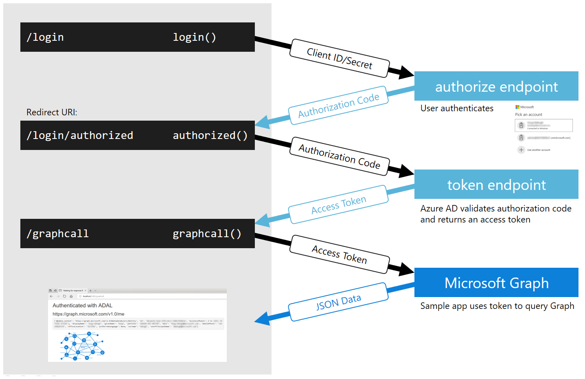

# Microsoft Graph authentication

## The application

  
Requirements

  
* `flask`
* `requests`
* `pyOpenSSL`

  
Source code steps

  
* Basic flask framework [(source)](https://github.com/scign/graph-auth/commit/12ca74eca248ade5f1a56b1820506aee8fa7da21)
* Get an authorization code [(source)](https://github.com/scign/graph-auth/commit/963bd0717d935725519e7c2f837b1ff125484533)
* Exchange the authorization code for an access token [(source)](https://github.com/scign/graph-auth/commit/3677f899d2257f9cc2dbc75387bb9125802e4dc6)
* Make a basic Graph API call [(source)](https://github.com/scign/graph-auth/commit/02bc7c51ccf25861e747b2af46b638d0ecb03d6c)
* Refresh the access token if it has expired [(source)](https://github.com/scign/graph-auth/commit/4fbc23f1b4c9c29ac2f99d0f7a467605ace1d8b5)

  
How it works

1. Construct the sign-in link
1. User clicks the link and authenticates
1. An authorization code is sent to the Redirect URI configured in the app
1. Exchange the authorization code for an access token
1. Store the access token as well as its expiration time and the refresh token
1. Check if the access token has expired whenever calling the Graph API; if it has, refresh it

## Setup

  
Create an App registration

Go to https://portal.azure.com/#blade/Microsoft_AAD_RegisteredApps/ApplicationsListBlade
* Click "New registration" and add a name for the registration.
* Make sure the selection is set to "Accounts in this organizational directory only" / single tenant
* Leave the Redirect URI blank, we'll fill that in later
* Click Register
* In the new App registration click "Certificates and secrets"
* Click "New client secret"
* Select "Never", leave the description blank, and click "Add"
* Copy the value into the clipboard
* Also copy the "Application (client) ID" and "Directory (tenant) ID"

  
Create an App Service

Go to https://portal.azure.com/#blade/HubsExtension/BrowseResource/resourceType/Microsoft.Web%2Fsites
* Click "Add"
* Select a subscription (add one if you don't have one already) and create a new resource group for this app
* Give the app a name, which will be the site subdomain name
* Leave the selection as publish code, and for the runtime stack select Python 3.7
* Leave the operating system as Linux and set the Region to Canada Central
* Create a new App Service Plan using the Free tier

  
Configure the App Service

* Once your App Service is created, click "Go to resource"
* Under "Settings" click "Configuration"
* Add new Application Settings values:
  * AZURE_APP_ID  =  "Application (client) ID" (from the App registration)
  * AZURE_TENANT_ID  =  "Directory (tenant) ID" (from the App registration)
  * AZURE_APP_SECRET  =  Client secret (from the App registration)
* Save the settings
* In the App Service Overview, copy the URL to the clipboard
* In the **App Registration** in the Overview blade, click "Add a Redirect URI"
* Select "Add a platform" and select "Web"
* Paste the address you just copied, and add `/get_token` to the end

  
Deploy your code

* In the App Service click "Deployment Center"
* Select Github and continue
* Continue to stay with App Service build service
* Select the repository from the dropdown menu, continue, and finish

